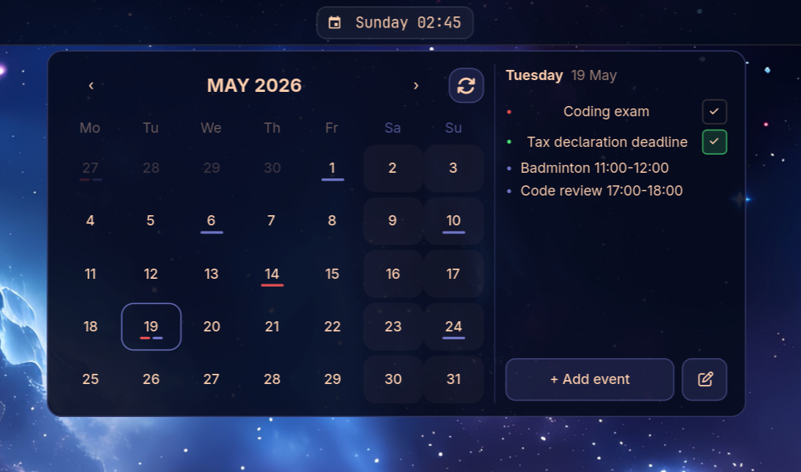
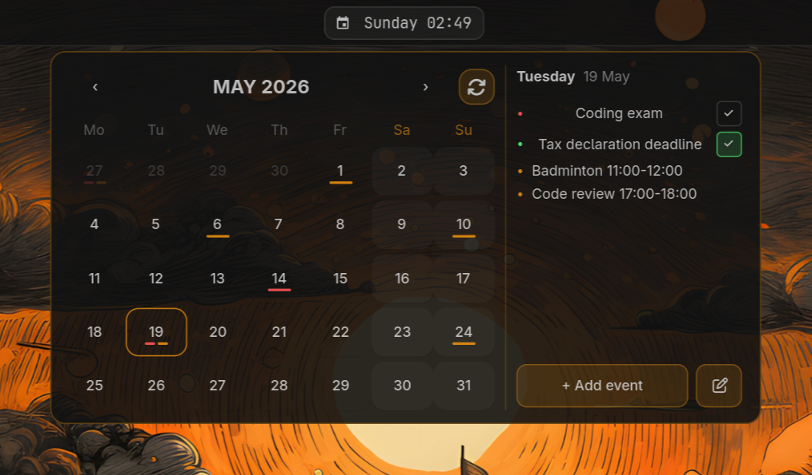

# waybar-ycal

A Google Calendar + Google Tasks popup widget for [Waybar](https://github.com/Alexays/Waybar) on Wayland.


*With [Omarchy](https://github.com/basecamp/omarchy) theme:*


- Click the bar module to open/close the popup — click anywhere outside to dismiss
- Browse months, see events and tasks per day
- Toggle tasks complete/incomplete inline
- Auto-syncs every 15 minutes, manual refresh button available
- Themed from your system colors (supports [Omarchy](https://github.com/basecamp/omarchy), falls back to built-in defaults)

## Usage philosophy

This widget treats **Google Tasks** and **Google Calendar events** as two distinct things:

- **Tasks** (red indicator) — important deadlines only. Things that *must* happen by a specific date. The red color makes them stand out so you never miss them.
- **Events** (accent color indicator) — everything else. Meetings, plans, reminders, anything time-based.

The separation keeps the calendar clean: if you see red, it matters.

---

## Installation

### Arch Linux (AUR) — recommended

Dependencies are handled automatically.

```bash
yay -S waybar-ycal
systemctl --user enable --now waybar-ycal.service
```

Updates automatically with `yay -Syu`.

### Manual (other distros)

**1. Install dependencies**

**Ubuntu/Debian:**
```bash
sudo apt install python3-gi python3-gi-cairo gir1.2-gtk-4.0 \
    python3-google-auth python3-google-auth-oauthlib
pip install --user google-api-python-client
```

> **gtk4-layer-shell** is required and may need to be built from source on Ubuntu. See [gtk4-layer-shell](https://github.com/wmww/gtk4-layer-shell).

**2. Clone and install**

```bash
git clone https://github.com/yagybaba/waybar-ycal
cd waybar-ycal
./install.sh
```

The installer copies scripts to `~/.config/waybar-ycal/`, installs a systemd user service, and starts the daemon.

---

## Google Cloud setup

You need OAuth2 credentials from Google Cloud. This is a one-time setup.

1. Go to [Google Cloud Console](https://console.cloud.google.com/)
2. Create a new project (or use an existing one)
3. **Enable APIs** — search and enable both:
   - Google Calendar API
   - Google Tasks API
4. Go to **APIs & Services → Credentials → Create Credentials → OAuth client ID**
   - Application type: **Desktop app**
   - After creating, go to the **Audience** tab (left sidebar) and add your Google account email under **Test users**
   - **Download the JSON from the confirmation dialog** — this is only available at creation time
6. Place the downloaded file at:
   ```
   ~/.config/waybar-ycal/credentials.json
   ```

---

## Waybar config

Add to your `config.jsonc`:

**AUR install:**
```jsonc
"custom/ycal": {
    "exec": "/usr/share/waybar-ycal/bar.py",
    "on-click": "/usr/share/waybar-ycal/toggle.sh",
    "interval": 60,
    "return-type": "json"
}
```

**Manual install:**
```jsonc
"custom/ycal": {
    "exec": "~/.config/waybar-ycal/bar.py",
    "on-click": "~/.config/waybar-ycal/toggle.sh",
    "interval": 60,
    "return-type": "json"
}
```

Add to your modules list (includes a clock, no need for a separate `clock` module):
```jsonc
"modules-center": ["custom/ycal"]
```

### style.css (optional)

```css
#custom-ycal {
    letter-spacing: 0.5px;
}
```

The popup is self-styled and does not depend on Waybar's CSS.

---

## First-time authentication

Click the bar module to open the popup. It will detect that `credentials.json` is missing or that you haven't authenticated yet, and guide you through the process:

1. **No credentials** — click **Open Google Cloud Console**, download and place the JSON file. The popup detects the file automatically and advances.
2. **Not authenticated** — click **Authenticate**, log in through the browser. The popup fetches your calendars and tasks and opens automatically.

The token is saved to `~/.cache/waybar-ycal/token.json` and refreshed silently when it expires.

---

## Theming

If you use [Omarchy](https://github.com/basecamp/omarchy), the popup reads colors from:
```
~/.config/omarchy/current/theme/colors.toml
```

Expected keys: `foreground`, `background`, `accent`. Falls back to built-in dark defaults if the file is missing.

Task indicators are always red (`#ff5555`) and completed task dots are green (`#50fa7b`) — hardcoded by design to stay visible across themes.

### Nerd Font

The refresh and edit icons require a [Nerd Font](https://www.nerdfonts.com/).
Any Nerd Font works — update `NERD_FONT` at the top of `popup.py` to match your font name.

The bar module uses the `󰃭` icon (Nerd Font codepoint `U+F00ED`).

---

## How it works

| File | Role |
|------|------|
| `popup.py` | GTK4 daemon — renders the popup, handles Google API calls |
| `bar.py` | Waybar module — prints JSON with icon + date |
| `toggle.sh` | Sends SIGUSR1 to daemon to show/hide popup |

The daemon syncs on startup, then every 15 minutes. Click the refresh button in the popup header for an immediate sync.
